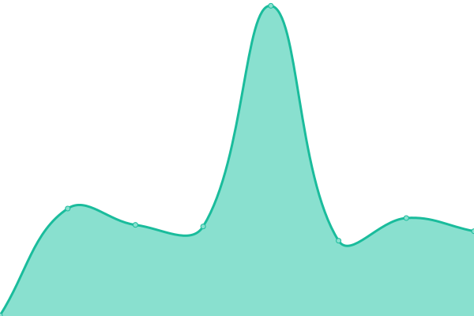

# [📈 Live Status](https://status.stefcodes.co.uk): <!--live status--> **🟩 All systems operational**

This repository contains the open-source uptime monitor and status page for [Stefan Baciu](https://stefcodes.co.uk), powered by [Upptime](https://github.com/upptime/upptime).

With [Upptime](https://upptime.js.org), you can get your own unlimited and free uptime monitor and status page, powered entirely by a GitHub repository. We use [Issues](https://github.com/StefCoders/status/issues) as incident reports, [Actions](https://github.com/StefCoders/status/actions) as uptime monitors, and [Pages](https://status.stefcodes.co.uk) for the status page.

<!--start: status pages-->
<!-- This summary is generated by Upptime (https://github.com/upptime/upptime) -->
<!-- Do not edit this manually, your changes will be overwritten -->
<!-- prettier-ignore -->
| URL | Status | History | Response Time | Uptime |
| --- | ------ | ------- | ------------- | ------ |
|  [StefCodes](https://stefcodes.co.uk) | 🟩 Up | [stef-codes.yml](https://github.com/StefCoders/status/commits/HEAD/history/stef-codes.yml) | 

 284ms
     
 | 

<a href="https://status.stefcodes.co.uk/history/stef-codes">98.78%</a>
    

|  [DeepRadio](https://deepradio.co.uk) | 🟩 Up | [deep-radio.yml](https://github.com/StefCoders/status/commits/HEAD/history/deep-radio.yml) | 

 504ms
     
 | 

<a href="https://status.stefcodes.co.uk/history/deep-radio">100.00%</a>
    

|  [MoinestiFM](https://moinestifm.ro) | 🟩 Up | [moinesti-fm.yml](https://github.com/StefCoders/status/commits/HEAD/history/moinesti-fm.yml) | 

 1869ms
     
 | 

<a href="https://status.stefcodes.co.uk/history/moinesti-fm">100.00%</a>
    

|  [DeepRadio Listen](https://listen.deepradio.co.uk) | 🟩 Up | [deep-radio-listen.yml](https://github.com/StefCoders/status/commits/HEAD/history/deep-radio-listen.yml) | 

 976ms
     
 | 

<a href="https://status.stefcodes.co.uk/history/deep-radio-listen">98.12%</a>
    

|  [MoinestiFM Listen](https://listen.moinestifm.ro) | 🟩 Up | [moinesti-fm-listen.yml](https://github.com/StefCoders/status/commits/HEAD/history/moinesti-fm-listen.yml) | 

 2412ms
     
 | 

<a href="https://status.stefcodes.co.uk/history/moinesti-fm-listen">98.06%</a>
    

<!--end: status pages-->

[**Visit our status website →**](https://status.stefcodes.co.uk)

## 📄 License

- Powered by: [Upptime](https://github.com/upptime/upptime)
- Code: [MIT](./LICENSE) © [Anand Chowdhary](https://anandchowdhary.com), supported by [Pabio](https://pabio.com)
- Data in the `./history` directory: [Open Database License](https://opendatacommons.org/licenses/odbl/1-0/)
